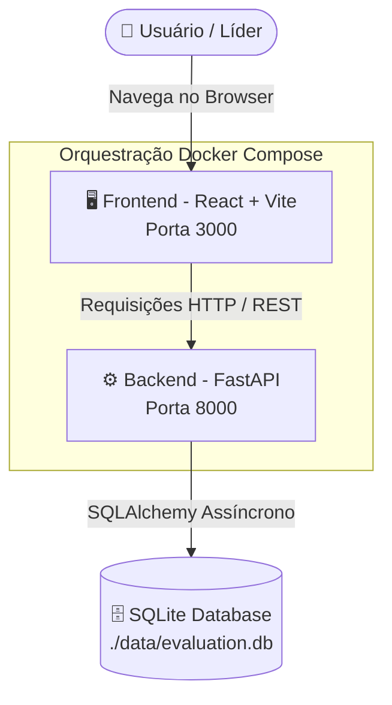

# 🌟 Evaluation App

Sistema completo para gestão de avaliações de desempenho profissional baseado em estruturas hierárquicas corporativas (líderes e liderados). A solução é composta por uma aplicação web moderna (SPA) e uma API REST assíncrona.

---

## 🏗️ Arquitetura e Fluxo do Sistema

### 1. Diagrama de Arquitetura

O sistema é construído no modelo cliente-servidor desacoplado, com orquestração opcional via Docker Compose:



### 2. Explicação dos Componentes

- **Frontend (`evaluation-web`)**:
  - **Tecnologias**: React 19, TypeScript, Vite, React Router DOM.
  - **Responsabilidade**: Interface de usuário responsiva para autenticação, visualização de equipes hierárquicas, listagem de avaliações pendentes, acompanhamento de histórico e preenchimento de formulários de feedback com critérios ponderados.
- **Backend (`evaluation-api`)**:
  - **Tecnologias**: Python 3.12+, FastAPI, SQLAlchemy (aiosqlite), Pydantic Settings, Uvicorn.
  - **Responsabilidade**: Regras de negócio, cálculo de pontuações ponderadas, validação de líderes/liderados, dedup de critérios, rotas REST e documentação interativa automática (OpenAPI/Swagger).
- **Banco de Dados**:
  - **Tecnologia**: SQLite 3 com driver assíncrono (`aiosqlite`).
  - **Estrutura**: Tabelas para `employee` (funcionários), `leader_lead` (relação hierárquica recursiva), `question` (critérios e pesos), `evaluation` (ciclos) e `answer` (respostas e notas).

---

## 🔑 Onde Colocar as Chaves e Variáveis de Ambiente

O projeto utiliza arquivos `.env` para centralizar configurações e credenciais em cada aplicação.

### 1. Backend (`evaluation-api/.env`)

Crie ou edite o arquivo [evaluation-api/.env](file:///c:/evaluation_app/evaluation-api/.env) com as seguintes configurações:

```env
APP_NAME=Evaluation API
DATABASE_URL=sqlite+aiosqlite:///./data/evaluation.db
ENV=development
```

| Variável | Descrição | Exemplo Padrão |
| :--- | :--- | :--- |
| `APP_NAME` | Nome identificador da API | `Evaluation API` |
| `DATABASE_URL` | String de conexão assíncrona SQLAlchemy | `sqlite+aiosqlite:///./data/evaluation.db` |
| `ENV` | Ambiente de execução (`development`, `production`) | `development` |

### 2. Frontend (`evaluation-web/.env`)

Crie ou edite o arquivo [evaluation-web/.env](file:///c:/evaluation_app/evaluation-web/.env) (você pode se basear em `.env.example`):

```env
URL_API=http://localhost:8000
```

| Variável | Descrição | Exemplo Padrão |
| :--- | :--- | :--- |
| `URL_API` | URL base do backend acessível pelo navegador do usuário | `http://localhost:8000` |
| `VITE_URL_API` | Alias alternativo suportado pelo Vite | `http://localhost:8000` |

> [!NOTE]
> Em aplicações Single Page Application (SPA), as requisições HTTP partem do navegador do usuário (máquina host). Portanto, mesmo utilizando Docker, o frontend precisa apontar para `http://localhost:8000` e não para o hostname interno da rede Docker.

---

## 🚀 Instruções de Setup e Execução

Você pode executar o projeto de duas formas:
1. **Com Docker & Docker Compose** (método mais simples e rápido).
2. **Localmente sem Docker** (executando API e Web nativamente).

---

### Opção 1: Executando com Docker Compose (Recomendado)

#### Pré-requisitos
- [Docker](https://www.docker.com/) e Docker Compose instalados e em execução.

#### Passo a Passo:
1. Certifique-se de estar na raiz do projeto (`c:/evaluation_app`):
   ```bash
   cd c:/evaluation_app
   ```

2. Construa e suba todos os serviços:
   ```bash
   docker compose up --build
   ```

3. Pronto! Os serviços estarão disponíveis em:
   - **Aplicação Web (Frontend)**: [http://localhost:3000](http://localhost:3000)
   - **API Backend**: [http://localhost:8000](http://localhost:8000)
   - **Documentação Interativa Swagger**: [http://localhost:8000/docs](http://localhost:8000/docs)
   - **Documentação ReDoc**: [http://localhost:8000/redoc](http://localhost:8000/redoc)

Para encerrar os containers:
```bash
docker compose down
```

---

### Opção 2: Executando Localmente (Manual)

#### Pré-requisitos
- **Python 3.12+** instalado
- **Node.js 20+** ou **22+** e **npm** instalados
- **SQLite3** instalado na máquina

---

#### 1. Configurando e Executando a API (`evaluation-api`)

##### i. Instalar Dependências
Abra um terminal no diretório da API:
```bash
cd evaluation-api
```

Crie e ative o ambiente virtual:
- **Windows (PowerShell)**:
  ```powershell
  python -m venv .venv
  .\.venv\Scripts\Activate.ps1
  ```
- **Linux / macOS**:
  ```bash
  python3 -m venv .venv
  source .venv/bin/activate
  ```

Instale os pacotes:
```bash
pip install -r requirements.txt
```

##### ii. Inicializar o Banco de Dados
Crie a pasta `data` e execute o script SQL com os dados iniciais:
- **Linux / macOS / Git Bash**:
  ```bash
  mkdir -p data
  sqlite3 ./data/evaluation.db < schema.sql
  ```
- **Windows PowerShell**:
  ```powershell
  if (!(Test-Path -Path "data")) { New-Item -ItemType Directory -Path "data" }
  Get-Content schema.sql | sqlite3 .\data\evaluation.db
  ```

##### iii. Executar a API
Inicie o servidor de desenvolvimento:
```bash
uvicorn app.main:app --reload --host 0.0.0.0 --port 8000
```
A API estará ativa em `http://localhost:8000`.

---

#### 2. Configurando e Executando o Frontend (`evaluation-web`)

##### i. Instalar Dependências
Abra um novo terminal no diretório do frontend:
```bash
cd evaluation-web
```

Instale as dependências com o npm:
```bash
npm install
```

##### ii. Configurar Chaves / Ambiente
Verifique se o arquivo `.env` existe com a URL da API:
```bash
# Caso não exista:
cp .env.example .env
```
Conteúdo do arquivo `.env`:
```env
URL_API=http://localhost:8000
```

##### iii. Executar a Aplicação Web
Inicie o servidor de desenvolvimento:
```bash
npm run dev
```

Acesse no navegador a URL informada pelo terminal (geralmente [http://localhost:3000](http://localhost:3000) ou [http://localhost:5173](http://localhost:5173)).

---

## 👥 Identificação de Liderança (`localStorage`) e Troca Rápida de Líder

Conforme especificado nos requisitos, a aplicação não exige um sistema de autenticação complexo com senhas, utilizando o **`localStorage`** do navegador (chave `'user'`) para armazenar e identificar o líder ativo:

```json
{
  "id": 2,
  "name": "Bob Sinclair",
  "email": "bob.sinclair@company.com",
  "position_name": "CTO"
}
```

### Como Alternar Entre Diferentes Líderes:
1. **Tela Inicial (`"Selecionar liderança"`)**: Na rota `/`, escolha a liderança pelo seletor (`Líder`) e clique em **"Acessar avaliações"**, ou clique diretamente em um dos botões de **"Acesso rápido"**.
2. **Seletor no Topo da Aplicação (`"Trocar líder:"`)**: Em qualquer tela interna (`/home/evaluations` ou `/home/employee`), basta selecionar outro líder no menu suspenso localizado no cabeçalho superior para atualizar imediatamente o `localStorage` e recarregar a visão hierárquica correspondente.

| Código (ID) | Nome | Cargo / Perfil | Equipe / Liderados Diretos |
| :---: | :--- | :--- | :--- |
| `#1` | **Alice Hartman** | CEO | Bob (`2`), Carol (`3`), Frank (`6`), Tina (`20`) |
| `#2` | **Bob Sinclair** | CTO | David (`4`), Eva (`5`), Grace (`7`), Paul (`16`), Quinn (`17`) |
| `#3` | **Carol Nguyen** | CFO | Rachel (`18`), Samuel (`19`) |
| `#4` | **David Okafor** | Engineering Manager | Henry Patel (`8`), Liam Johansson (`12`) |
| `#5` | **Eva Müller** | Engineering Manager | Isabelle (`9`), Mia (`13`), Noah (`14`) |
| `#6` | **Frank Rossi** | Product Manager | Olivia (`15`) |
| `#8` | **Henry Patel** | Senior Software Engineer | James Watanabe (`10`), Karen Oliveira (`11`) |

---

## 📂 Estrutura do Projeto

```text
evaluation_app/
├── docker-compose.yml          # Orquestração do Frontend e Backend
├── README.md                   # Documentação geral do projeto
│
├── evaluation-api/             # Backend (FastAPI + SQLAlchemy Assíncrono)
│   ├── app/
│   │   ├── core/               # Configurações e variáveis de ambiente
│   │   ├── database/           # Sessão assíncrona e conexão SQLite
│   │   ├── dto/                # Schemas de validação Pydantic
│   │   ├── modules/            # Módulos: employee, leader, evaluation
│   │   └── main.py             # Ponto de entrada FastAPI e middlewares
│   ├── data/                   # Armazenamento do banco SQLite (evaluation.db)
│   ├── .env                    # Variáveis de ambiente da API
│   ├── Dockerfile              # Imagem Docker da API
│   ├── requirements.txt        # Dependências Python
│   ├── schema.sql              # Esquema DDL e carga de dados de exemplo
│   └── README.md               # Documentação aprofundada dos endpoints da API
│
└── evaluation-web/             # Frontend (React 19 + TypeScript + Vite)
    ├── src/
    │   ├── components/         # Componentes reutilizáveis
    │   ├── config/             # Configuração da URL da API
    │   ├── pages/              # Telas (Login, Home, Avaliações, Colaborador)
    │   ├── services/           # Comunicação HTTP com a API
    │   └── types/              # Definições TypeScript
    ├── .env                    # Variáveis de ambiente do Frontend
    ├── Dockerfile              # Imagem Docker multi-stage do Frontend
    └── package.json            # Dependências e scripts npm
```

## Documentação da API

A API possui documentação interativa gerada automaticamente pelo FastAPI.

Após iniciar o backend, acesse:

http://localhost:8000/docs

Também está disponível a especificação OpenAPI em:

http://localhost:8000/openapi.json